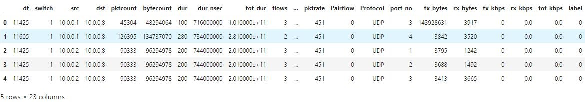

## 1. IP Spoofing simultaion carried out using [scapy](https://scapy.net/) and observed in [Wireshark](https://www.wireshark.org/)

### Open the terminal, Install scapy using pip

```
>>> pip install scapy
```

### Create a basic packet with src and destination IP address, ttl(time to live), protocol to be used etc.

```
>>> x = IP(ttl=64)
>>> x.src = "192.36.151.40"
>>> x.dst = "183.81.159.136"
>>> x = x/TCP()/"Test-Packet Recieved"
>>> x
<IP  frag=0 ttl=64 proto=tcp src=192.36.151.40 dst=183.81.159.136 |<TCP  |<Raw  load='Test-Packet Recieved'
```

### Open wireshark and connect to the same network to which sender is connected to. Open the Network and apply the filter as follows:

```
ip.dst == 183.81.159.136
```

### Press <b>Start capturing</b> button and then send the packets as below with `count` set to how many packets to be sent:

```
>>> send(x, count=10)
```


### You can add more information to the packet to mimic a real-world data.

## 2. Detection using both Logistic Regression and Neural Network

### 2.1 Dataset:

#### The dataset <b>DDoS SDN dataset</b> is downloaded from [kaggle](https://www.kaggle.com/datasets/aikenkazin/ddos-sdn-dataset).

#### The dataset contains a total of 1,04,345 training examples.

#### contains 3 categorial and 19 numerical features, a total of 22 features.



#### contains a label column: `0` refers benign packet and `1` refers malignant IP packet.

#### The data is pre-processed and split into training (0.80) and testing (0.20) using pandas and sklearn library respectively.

### 2.2 Model training:

### Logistic Regression Model:
#### Install Required libraries using pip

```
pip install numpy pandas sklearn
```

#### The `logisticRegression` class in `sklearn.linear_model` is used to create an instance of the model. This model is trained with `max_iters`(total no. of iterations to be run to train the model) is set to 10000.

### Neural Networks Model:
#### Install the [tensorflow](https://www.tensorflow.org/api_docs/python/tf) library using below command

```
pip install tensorflow
```

#### Model contains two hidden layers each having 10 units and a third output layer having one unit.

#### "Adam" and "BinaryCrossentropy" is used as optimizer and loss function respectively.

#### 15 Epochs with a default batch_size of 32 is set while training the model.

### 2.3 Model Evaluation:

#### An accuracy of 70.16 % is achieved by using Logistic Regression.

#### An accuracy of 98.96 % is achieved by using NN model.

#### Both the jupyter source files are uploaded in the src directory.
